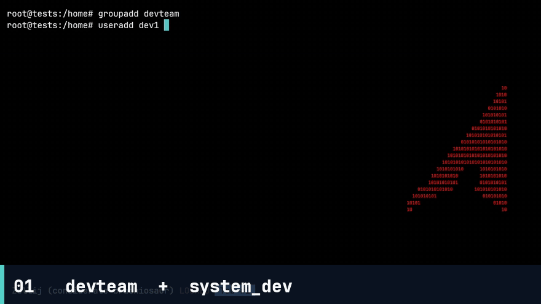
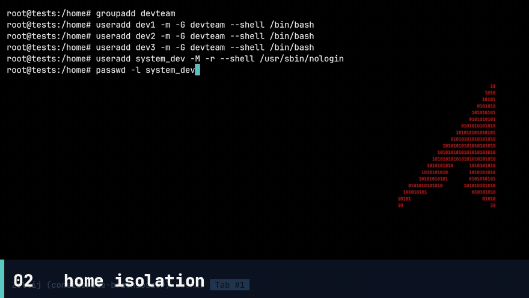
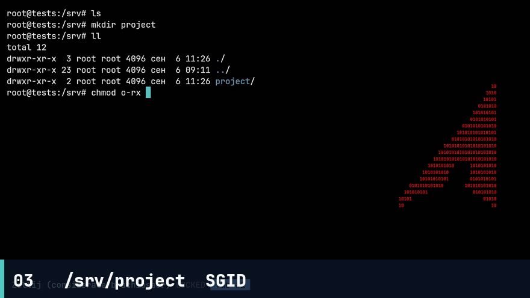
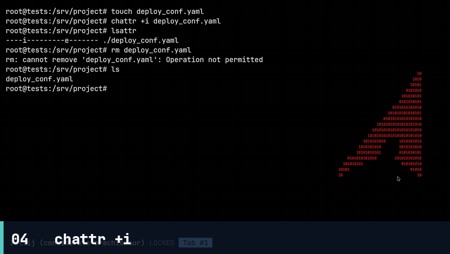
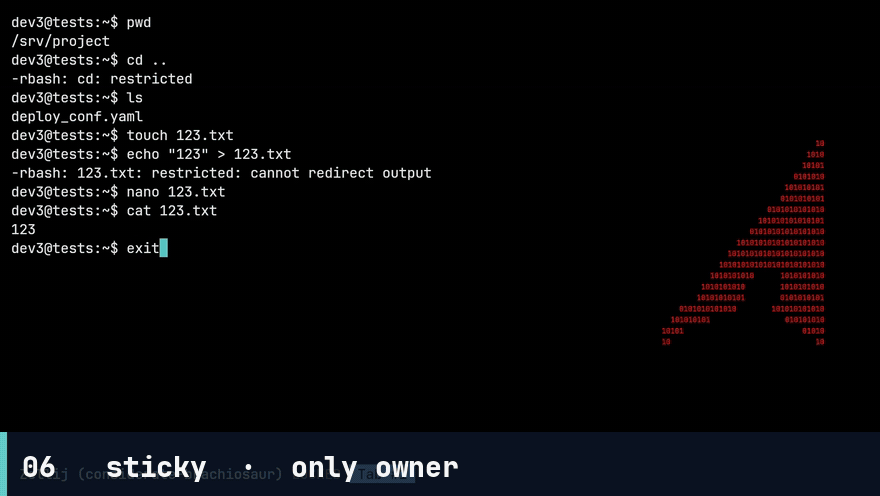
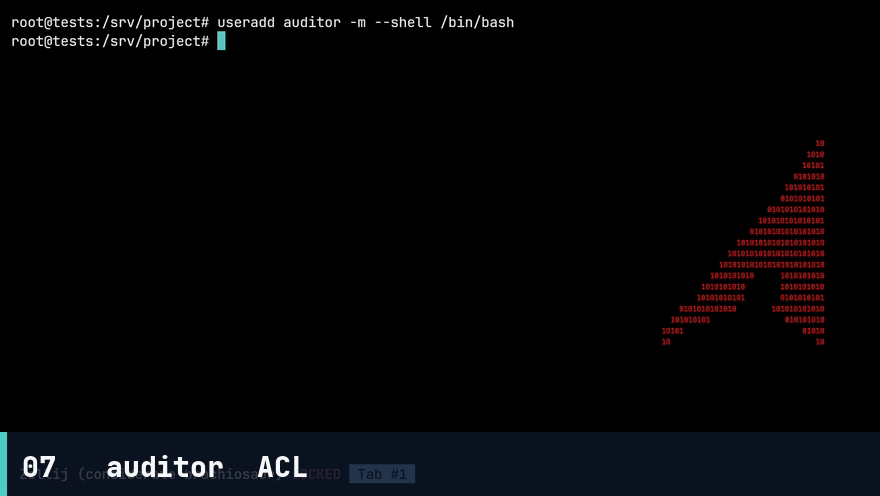
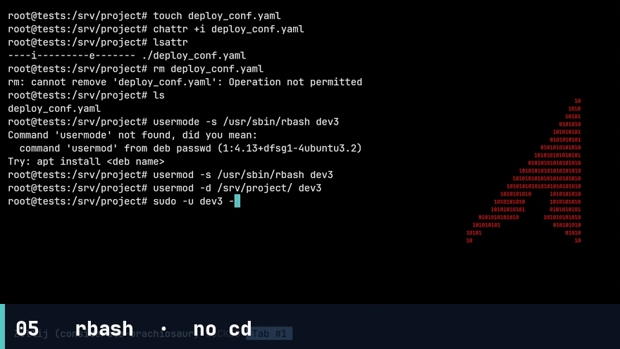
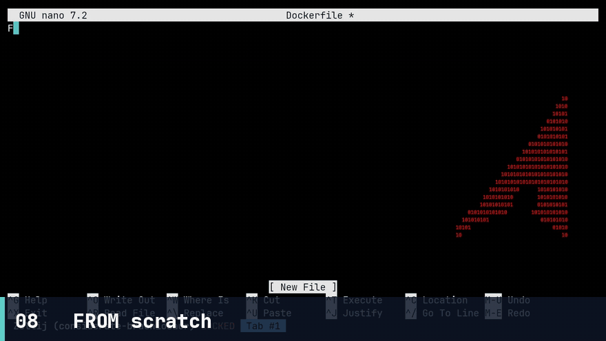
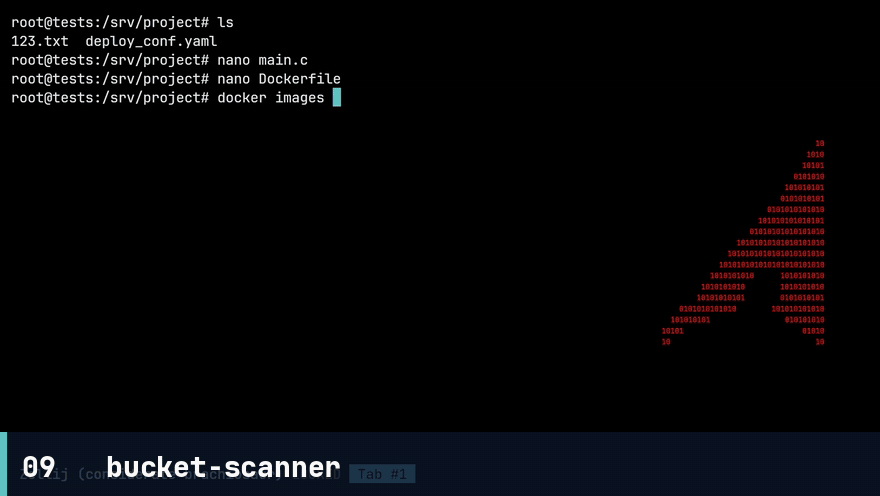
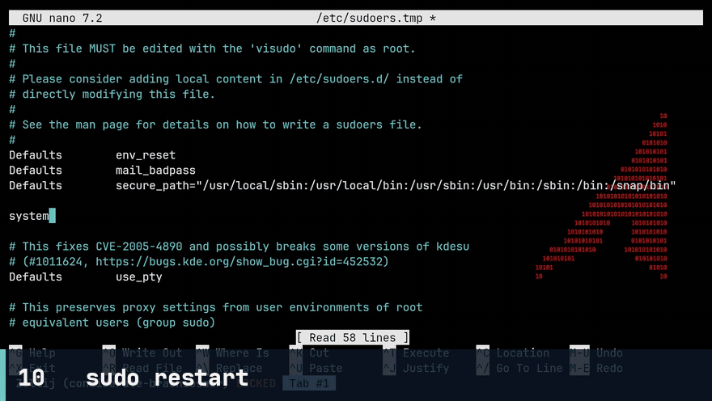

# Блок 1. Защищённая среда + деплой bucket-scanner

Сервер для команды из 3 разработчиков. Цель: изоляция пользователей, общий проект с контролируемыми правами, контейнер приложения, узкий sudo для сервисного аккаунта.

**Полное видео:** [блок-1.mp4](./block-1.mp4) (~6:38)

Клипы из записи вставлены в разделы ниже. Все файлы лежат в [`gifs/`](./gifs/).

Подставляемые имена:

| Роль | Логин |
|------|--------|
| Разработчик 1 | `dev1` |
| Разработчик 2 | `dev2` |
| Разработчик 3 (rbash) | `dev3` |
| Сервис | `system_dev` |
| Аудитор (не в `devteam`) | `auditor` |

---

## A — Пользователи

Группа `devteam`, три разработчика, сервисный `system_dev` без интерактивного входа.

```bash
sudo groupadd -f devteam

sudo useradd -m -s /bin/bash -G devteam dev1
sudo useradd -m -s /bin/bash -G devteam dev2
sudo useradd -m -s /bin/rbash -G devteam dev3

sudo passwd dev1
sudo passwd dev2
sudo passwd dev3

sudo useradd -r -M -s /usr/sbin/nologin system_dev
sudo passwd -l system_dev
```

Проверки:

```bash
getent group devteam
getent passwd system_dev
# shell должен быть nologin
sudo passwd -S system_dev
# L = locked
```

`system_dev` не должен уметь `su`/`ssh` по паролю. Для docker-restart используется только sudo (пункт H).

<div align="center">



*Группа `devteam`, три разработчика и `system_dev` с `nologin`*

</div>

---

## B — Домашние директории: изоляция друг от друга

Обычные пользователи не читают чужой `$HOME`. Root видит всё.

```bash
sudo chmod 750 /home/dev1 /home/dev2 /home/dev3
sudo chown dev1:dev1 /home/dev1
sudo chown dev2:dev2 /home/dev2
sudo chown dev3:dev3 /home/dev3
```

Если нужен вход в группу только владельца (классическая изоляция):

```bash
sudo chmod 700 /home/dev1 /home/dev2 /home/dev3
```

Проверки:

```bash
# от имени dev1 — отказ
sudo -u dev1 ls /home/dev2
# от root — успех
sudo ls /home/dev1 /home/dev2 /home/dev3
```

<div align="center">



*`dev1` не читает `/home/dev2`, root видит все home*

</div>

---

## C — `/srv/project`: SGID, sticky, immutable config

```bash
sudo mkdir -p /srv/project
sudo chown root:devteam /srv/project
# rwx для владельца и группы, --- для остальных
# setgid (2): новые файлы наследуют группу каталога (devteam)
# sticky (1): удалить файл может только владелец (или root)
sudo chmod 2770 /srv/project
```

`2770` = `sgid` + `sticky` + `rwxrwx---` для `root:devteam`.

<div align="center">



*`/srv/project`: владелец `root:devteam`, режим `2770` (SGID)*

</div>

```bash
# конфиг деплоя, который нельзя менять даже членам группы
sudo tee /srv/project/deploy_config.yml >/dev/null <<'EOF'
app: bucket-scanner
container: bucket-scanner
listen: 8080
EOF

sudo chown root:devteam /srv/project/deploy_config.yml
sudo chmod 640 /srv/project/deploy_config.yml
sudo chattr +i /srv/project/deploy_config.yml
```

Проверки:

```bash
stat /srv/project | grep -E 'Access|Uid|Gid'
ls -ld /srv/project
# должен быть drwxrws--T или drwxrws--t (T = sticky без execute для others)
lsattr /srv/project/deploy_config.yml
# ----i---------

# снять immutable только через root при необходимости:
# sudo chattr -i /srv/project/deploy_config.yml
```

Наследование группы: файл, созданный `dev1` в `/srv/project`, должен иметь группу `devteam`.

Sticky: `dev2` не удаляет файл `dev1`.

<div align="center">



*`chattr +i` на `deploy_config.yml` — конфиг нельзя править даже из группы*

</div>

<div align="center">



*Sticky: `dev2` не удаляет файл, созданный `dev1`*

</div>

---

## D — ACL для `auditor`

Аудитор **не** состоит в `devteam`. Нужен только просмотр проекта: `r-x` на каталог, чтение файлов, **без записи**.

```bash
sudo useradd -m -s /bin/bash auditor
sudo passwd auditor

# каталог: вход и листинг, без записи
sudo setfacl -m u:auditor:rx /srv/project
sudo setfacl -d -m u:auditor:rx /srv/project

# существующие файлы — только чтение
sudo find /srv/project -type f -exec setfacl -m u:auditor:r {} \;
```

`deploy_config.yml` с `chattr +i` остаётся неизменяемым; ACL на чтение для auditor всё равно можно выставить.

Проверки:

```bash
getent group devteam | grep -q auditor && echo FAIL || echo OK_not_in_devteam
sudo -u auditor ls /srv/project
sudo -u auditor cat /srv/project/deploy_config.yml
sudo -u auditor touch /srv/project/auditor_write_test
# должен быть Permission denied
getfacl /srv/project
```

<div align="center">



*`auditor` не в `devteam`: чтение `/srv/project` есть, `touch` запрещён*

</div>

---

## E — Restricted shell (`rbash`) у одного разработчика

`dev3` уже с `/bin/rbash`. Дополнительно закрыть обходы: без `cd`, без абсолютных путей, без смены `PATH`, без перенаправления `>` / `>>`.

```bash
sudo mkdir -p /home/dev3/bin
sudo chown root:root /home/dev3/bin
sudo chmod 755 /home/dev3/bin

# только нужные бинарники через относительные имена
for cmd in ls cat less grep nano; do
  sudo ln -sf "$(command -v "$cmd")" /home/dev3/bin/"$cmd"
done

sudo tee /home/dev3/.bash_profile >/dev/null <<'EOF'
PATH="$HOME/bin"
export PATH
readonly PATH
EOF

sudo chown root:dev3 /home/dev3/.bash_profile
sudo chmod 640 /home/dev3/.bash_profile

# запрет записи в home (иначе rbash обходится через ~/.bashrc, симлинки)
sudo chown root:dev3 /home/dev3
sudo chmod 750 /home/dev3
sudo chmod 555 /home/dev3/bin
```

Ограничения `rbash`:

- `cd` — ошибка
- `/usr/bin/id` — абсолютный путь запрещён
- `PATH=/tmp` — `PATH` readonly / rbash не даёт менять
- `echo x > file` — redirect запрещён

Проверки (интерактивный SSH `dev3`):

```bash
cd /
/bin/ls
PATH=/tmp
echo test > /tmp/x
```

Всё должно завершаться отказом.

<div align="center">



*`dev3` в `rbash`: нет `cd`, нет абсолютных путей, нет смены `PATH` и редиректов*

</div>

---

## F — Приложение bucket-scanner (C, Docker, FROM scratch)

Простая C-программа, которая слушает порт и работает постоянно. Multi-stage: статическая линковка, финальный образ `FROM scratch`, контейнер с **явным именем** `bucket-scanner`.

Пример `/srv/project/bucket-scanner.c`:

```c
#include <arpa/inet.h>
#include <netinet/in.h>
#include <signal.h>
#include <stdio.h>
#include <stdlib.h>
#include <string.h>
#include <unistd.h>

static volatile int running = 1;

static void on_stop(int sig) {
    (void)sig;
    running = 0;
}

int main(void) {
    int s, c;
    struct sockaddr_in addr;
    char buf[256];
    const char *msg = "HTTP/1.1 200 OK\r\nContent-Type: text/plain\r\nContent-Length: 16\r\n\r\nbucket-scanner\n";

    signal(SIGTERM, on_stop);
    signal(SIGINT, on_stop);

    s = socket(AF_INET, SOCK_STREAM, 0);
    if (s < 0) return 1;
    int opt = 1;
    setsockopt(s, SOL_SOCKET, SO_REUSEADDR, &opt, sizeof(opt));
    memset(&addr, 0, sizeof(addr));
    addr.sin_family = AF_INET;
    addr.sin_addr.s_addr = htonl(INADDR_ANY);
    addr.sin_port = htons(8080);
    if (bind(s, (struct sockaddr *)&addr, sizeof(addr)) < 0) return 1;
    listen(s, 16);

    while (running) {
        c = accept(s, NULL, NULL);
        if (c < 0) continue;
        recv(c, buf, sizeof(buf), 0);
        send(c, msg, strlen(msg), 0);
        close(c);
    }
    close(s);
    return 0;
}
```

`/srv/project/Dockerfile`:

```dockerfile
FROM debian:bookworm-slim AS build
RUN apt-get update && apt-get install -y --no-install-recommends gcc libc6-dev \
    && rm -rf /var/lib/apt/lists/*
WORKDIR /src
COPY bucket-scanner.c .
RUN gcc -static -O2 -s -o bucket-scanner bucket-scanner.c

FROM scratch
COPY --from=build /src/bucket-scanner /bucket-scanner
EXPOSE 8080
USER 65534
ENTRYPOINT ["/bucket-scanner"]
```

<div align="center">



*Multi-stage: статическая линковка, финальный образ `FROM scratch`*

</div>

Сборка и запуск с именем контейнера (без wildcard в sudo — имя фиксированное):

```bash
cd /srv/project
sudo docker build -t bucket-scanner:local .
sudo docker rm -f bucket-scanner 2>/dev/null || true
sudo docker run -d --name bucket-scanner --restart unless-stopped \
  -p 8080:8080 bucket-scanner:local
```

После блока 2 контейнер лучше подключать в `br0` на `192.168.10.100/24` (см. README-block2), а не через `-p` и docker-bridge NAT.

Проверки:

```bash
sudo docker inspect bucket-scanner --format '{{.Name}} {{.State.Status}}'
file /tmp/check 2>/dev/null
# бинарь статически слинкован: после копирования из контейнера
sudo docker create --name bs-tmp bucket-scanner:local
sudo docker cp bs-tmp:/bucket-scanner /tmp/bucket-scanner.bin
sudo docker rm bs-tmp
file /tmp/bucket-scanner.bin
# statically linked
curl -sS http://127.0.0.1:8080
```

<div align="center">



*Контейнер с именем `bucket-scanner`, бинарь статически слинкован*

</div>

---

## G — SUID-аудит

Найти все файлы с SUID и убрать **подложенный** бит (не трогать штатные `/usr/bin/passwd`, `sudo` и т.п. без понимания).

```bash
sudo find / -xdev -perm /4000 -type f 2>/dev/null | tee /root/suid-audit.txt
```

Типичный «подлог» в лабе: копия шелла или утилита в `/tmp`, `/opt`, `/srv`.

```bash
# пример снятия SUID только с постороннего файла
sudo chmod u-s /path/to/planted-binary
```

Повторно:

```bash
sudo find /srv /tmp /opt /home -perm /4000 -type f 2>/dev/null
# пусто — ок
```

Фиксируйте список «до/после» для отчёта.

---

## H — Sudo: только `docker restart bucket-scanner`

`system_dev` может перезапустить **только** этот контейнер, без пароля, **без** `*` в команде.

`/etc/sudoers.d/system_dev` (редактировать через `visudo`):

```bash
sudo visudo -f /etc/sudoers.d/system_dev
```

Содержимое:

```
Defaults:system_dev !requiretty
system_dev ALL=(root) NOPASSWD: /usr/bin/docker restart bucket-scanner
```

Не писать `docker *`, `docker restart *`, `/usr/bin/docker *`.

Проверки:

```bash
sudo -U system_dev -l
sudo -u system_dev sudo docker restart bucket-scanner
sudo -u system_dev sudo docker ps
# должно быть отказано
sudo -u system_dev sudo docker restart other-name
# должно быть отказано
```

<div align="center">



*Одна точная команда NOPASSWD, без wildcard: `docker restart bucket-scanner`*

</div>

---

## Чеклист приёмки блока 1

- [ ] Три пользователя в `devteam`, `system_dev` = nologin + locked password
- [ ] `dev1` не читает `/home/dev2`, root читает оба
- [ ] `/srv/project` — SGID + sticky, группа `devteam`
- [ ] `lsattr` показывает `i` на `deploy_config.yml`
- [ ] `auditor` не в `devteam`, `r-x` на проект, `touch` запрещён
- [ ] `dev3`: rbash, нет `cd`, нет `/bin/ls`, нет смены `PATH`, нет `>`
- [ ] контейнер `bucket-scanner` запущен, образ от `scratch`, бинарь static
- [ ] SUID-подлог снят (`find -perm /4000`)
- [ ] sudoers: одна точная команда, NOPASSWD, без wildcard
