# Блок 2. Полная сетевая архитектура

Продолжение блока 1. Хост — «офисный» Linux с сегментами **dev**, **office**, **WAN**. Контейнер `bucket-scanner` сидит в L2-сети разработчиков `192.168.10.0/24` без NAT.

**Условия кейса:** [TZ.md](./TZ.md)  
**Полное видео:** [block-2.mp4](./block-2.mp4) (~19 мин)

Клипы из записи вставлены в разделы ниже. Все файлы лежат в [`gifs/`](./gifs/).

Схема адресов:

| Узел / интерфейс | Адрес |
|------------------|--------|
| `dev-router` (netns), `bond0` | `192.168.10.1/24` |
| DHCP-пул dnsmasq | `192.168.10.10–50` |
| контейнер scanner | `192.168.10.100/24` |
| `veth-dev` (в netns) | `10.200.0.2/30` |
| `veth-host` (хост) | `10.200.0.1/30` |
| `bond-office` | `10.0.0.5/24` |
| WAN | как выдаст провайдер/VM |
| WireGuard `wg0` | `10.8.0.1/24` |

`br0` и `bond0` **на хосте без IP**. IP шлюза разработчиков живёт только внутри namespace `dev-router`.

---

## I — `dev-router`: IP-less `br0`+`bond0`, netns, dnsmasq, выход в интернет

Идея:

1. На хосте `bond0` (active-backup) из пары veth, смотрит в `br0` **без адреса**.
2. В namespace `dev-router` — парный `bond0` из `veth1-peer` + `veth2-peer`, адрес `192.168.10.1/24`.
3. `dnsmasq` в том же namespace: DHCP, gateway и DNS = `192.168.10.1`.
4. Выход: `veth-dev` (`10.200.0.2/30`) ↔ `veth-host` (`10.200.0.1/30`) + MASQUERADE на WAN.

Создание (ядро: `bonding`, `br_netfilter` по необходимости):

```bash
sudo modprobe bonding
sudo ip netns add dev-router

# пара линков для active-backup между хостом и router ns
sudo ip link add veth1 type veth peer name veth1-peer
sudo ip link add veth2 type veth peer name veth2-peer
sudo ip link set veth1-peer netns dev-router
sudo ip link set veth2-peer netns dev-router

# host-side bond0 → br0, без IP
sudo ip link add bond0 type bond mode active-backup miimon 100
sudo ip link set veth1 down
sudo ip link set veth2 down
sudo ip link set veth1 master bond0
sudo ip link set veth2 master bond0
sudo ip link set bond0 up
sudo ip link set veth1 up
sudo ip link set veth2 up

sudo ip link add br0 type bridge
sudo ip link set bond0 master br0
sudo ip link set br0 up
# br0 и bond0 остаются без inet-адреса
```

<div align="center">

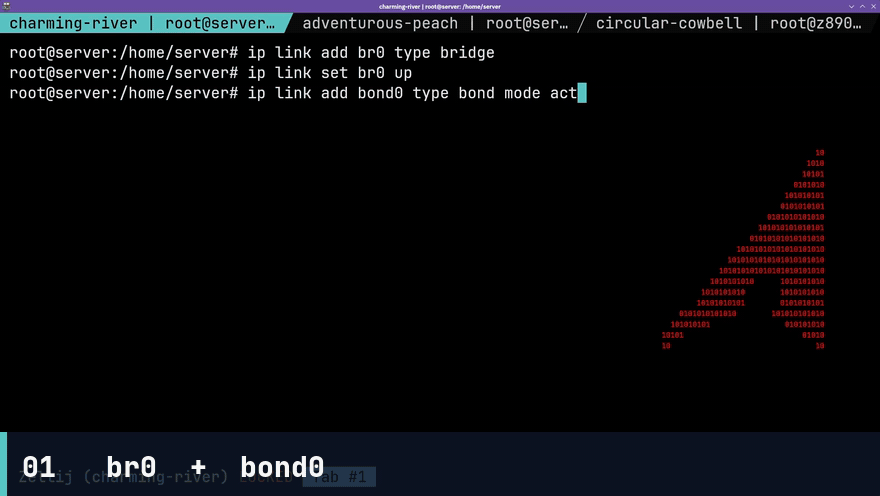

*На хосте `bond0` (active-backup) смотрит в `br0` без IP*

</div>

```bash
# router-side bond
sudo ip netns exec dev-router ip link add bond0 type bond mode active-backup miimon 100
sudo ip netns exec dev-router ip link set veth1-peer down
sudo ip netns exec dev-router ip link set veth2-peer down
sudo ip netns exec dev-router ip link set veth1-peer master bond0
sudo ip netns exec dev-router ip link set veth2-peer master bond0
sudo ip netns exec dev-router ip link set bond0 up
sudo ip netns exec dev-router ip link set veth1-peer up
sudo ip netns exec dev-router ip link set veth2-peer up
sudo ip netns exec dev-router ip addr add 192.168.10.1/24 dev bond0
sudo ip netns exec dev-router ip link set lo up
```

<div align="center">

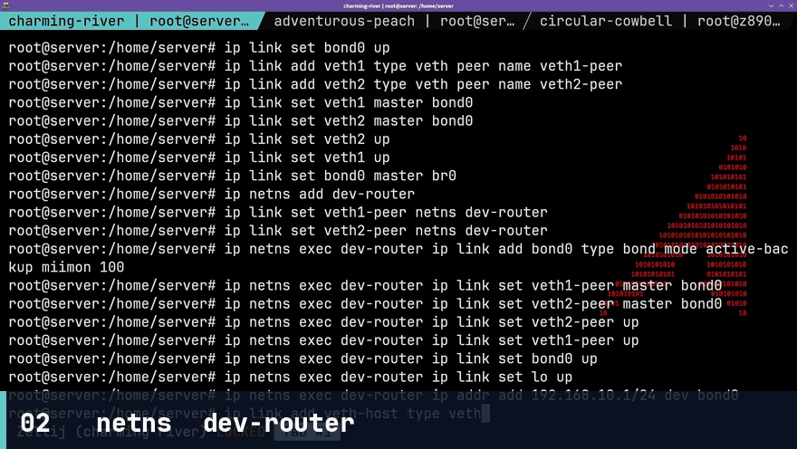

*Namespace `dev-router`: парный `bond0`, адрес шлюза `192.168.10.1/24`*

</div>

```bash
# uplink к хосту /30
sudo ip link add veth-host type veth peer name veth-dev
sudo ip link set veth-dev netns dev-router
sudo ip addr add 10.200.0.1/30 dev veth-host
sudo ip link set veth-host up
sudo ip netns exec dev-router ip addr add 10.200.0.2/30 dev veth-dev
sudo ip netns exec dev-router ip link set veth-dev up
sudo ip netns exec dev-router ip route add default via 10.200.0.1
```

<div align="center">

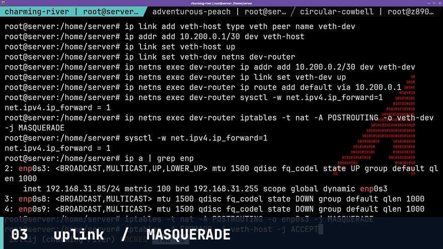

*Uplink `10.200.0.2` ↔ `10.200.0.1` `/30` + MASQUERADE на WAN*

</div>

Forward + MASQUERADE (черновой вариант до nftables из пункта L):

```bash
sudo sysctl -w net.ipv4.ip_forward=1
# WAN-интерфейс подставьте (часто enp0s3)
WAN=enp0s3
sudo nft add table ip nat 2>/dev/null || true
# полные правила — в разделе L
```

dnsmasq **внутри** namespace (не системный stub):

`/etc/netns/dev-router/dnsmasq.conf` или отдельный файл + `ip netns exec`:

```
interface=bond0
bind-interfaces
dhcp-range=192.168.10.10,192.168.10.50,12h
dhcp-option=option:router,192.168.10.1
dhcp-option=option:dns-server,192.168.10.1
no-resolv
server=1.1.1.1
```

Запуск:

```bash
sudo ip netns exec dev-router dnsmasq --conf-file=/etc/dnsmasq-dev-router.conf --pid-file=/run/dnsmasq-dev-router.pid
```

<div align="center">

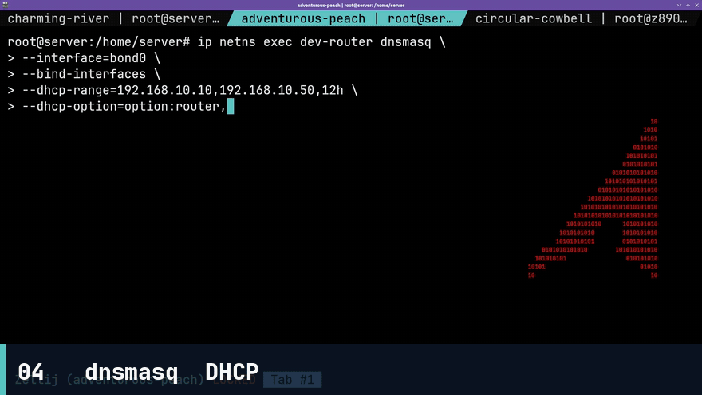

*`dnsmasq` в namespace: DHCP `192.168.10.10–50`, gateway и DNS = `192.168.10.1`*

</div>

`client1` — veth в `br0` (см. K), получает адрес из пула DHCP.

Failover без потери пингов: `miimon=100`, active-backup. Выключить активный slave (`ip link set veth1 down`) — ping к `192.168.10.1` не обрывается надолго (1–2 потерянных пакета допустимо, сессия ICMP жива).

<div align="center">

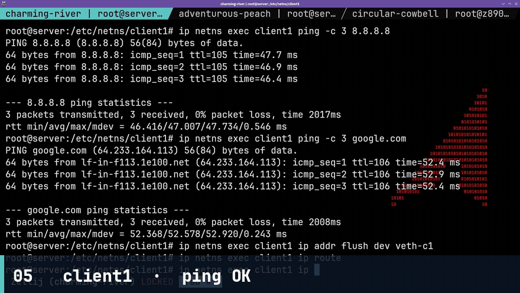

*`client1` получает адрес из пула и выходит в интернет через `dev-router`*

</div>

---

## J — PBR: `t_dev`, `t_office`, `t_wan`

`/etc/iproute2/rt_tables` — добавить (номера не пересекаются со штатными):

```
100 t_dev
101 t_office
102 t_wan
```

Правила по **source**:

```bash
# таблица t_dev: трафик от dev-router uplink
sudo ip route replace default via 10.200.0.1 table t_dev
# с хоста: пакеты, у которых src из 192.168.10.0/24 после маршрутизации
sudo ip rule add from 192.168.10.0/24 table t_dev priority 100
sudo ip route replace 192.168.10.0/24 dev br0 table t_dev 2>/dev/null || true
sudo ip route replace default via "$(ip -4 route show default | awk '{print $3; exit}')" table t_dev

# офис
sudo ip rule add from 10.0.0.0/24 table t_office priority 110
sudo ip route replace 10.0.0.0/24 dev bond-office table t_office
sudo ip route replace default via "$(ip -4 route show default | awk '{print $3; exit}')" table t_office

# WAN — основной default в t_wan, lookup для «прочих» / исходящих с WAN-адреса
sudo ip rule add from all lookup t_wan priority 32766
# или: ip rule add from <WAN-IP>/32 table t_wan
sudo ip route replace default via "$(ip -4 route show default | awk '{print $3; exit}')" table t_wan
```

Проверка: `ip rule show`, `ip route show table t_dev`.

Для стажёра (пункт M) позже добавляется `t_intern`.

<div align="center">

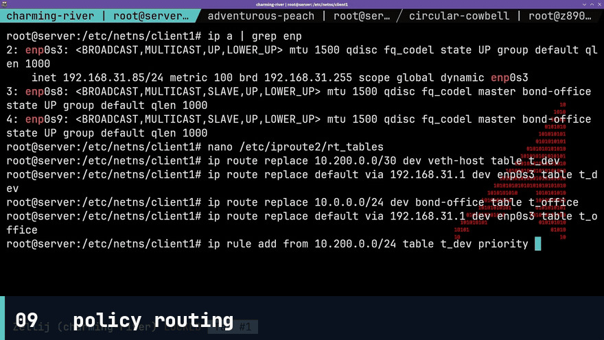

*PBR: таблицы `t_dev`, `t_office`, `t_wan` — маршруты по source*

</div>

---

## K — Bonding / Bridging на хосте

**Офис:** `bond-office` = `eth1` + `eth2`, mode `active-backup`, адрес `10.0.0.5/24`.

```bash
sudo ip link add bond-office type bond mode active-backup miimon 100
sudo ip link set eth1 down
sudo ip link set eth2 down
sudo ip link set eth1 master bond-office
sudo ip link set eth2 master bond-office
sudo ip addr add 10.0.0.5/24 dev bond-office
sudo ip link set bond-office up
sudo ip link set eth1 up
sudo ip link set eth2 up
```

<div align="center">

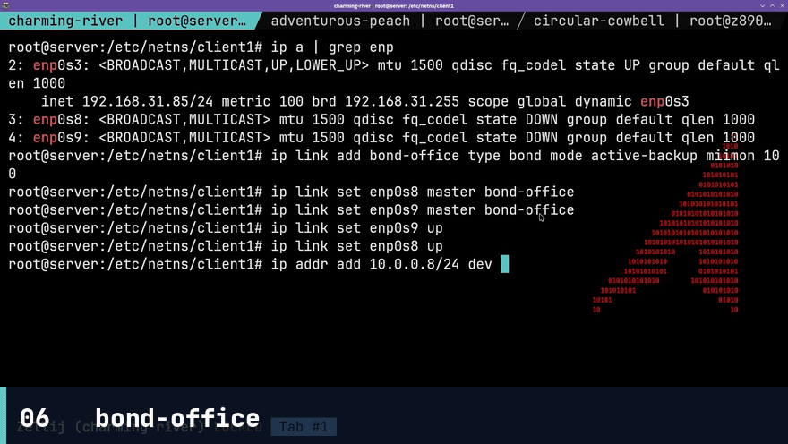

*`bond-office`: `eth1` + `eth2`, active-backup, `10.0.0.5/24`*

</div>

В VM имена могут быть `enp0s8`/`enp0s9` — смотрите `ip -br link`.

**IP-less `br0`** объединяет:

- `bond0` (к dev-router)
- `veth-b1` (client1)
- `veth-scanner-host` (контейнер `192.168.10.100/24`)

```bash
sudo ip link add veth-b1 type veth peer name veth-b1-peer
sudo ip link set veth-b1 master br0
sudo ip link set veth-b1 up
# peer отдать в netns client1 или в отдельную VM/ns:
sudo ip netns add client1
sudo ip link set veth-b1-peer netns client1
sudo ip netns exec client1 ip link set veth-b1-peer up
sudo ip netns exec client1 dhclient -v veth-b1-peer
# или: systemd-networkd DHCP в ns

# контейнер: macvlan/ipvlan от br0 ИЛИ veth в br0
sudo ip link add veth-scanner-host type veth peer name veth-scanner-ctr
sudo ip link set veth-scanner-host master br0
sudo ip link set veth-scanner-host up
```

Docker: `--network none` + переместить `veth-scanner-ctr` в netns контейнера и назначить `192.168.10.100/24`, gateway `192.168.10.1`:

```bash
PID=$(sudo docker inspect -f '{{.State.Pid}}' bucket-scanner)
sudo ip link set veth-scanner-ctr netns "$PID"
sudo nsenter -t "$PID" -n ip addr add 192.168.10.100/24 dev veth-scanner-ctr
sudo nsenter -t "$PID" -n ip link set veth-scanner-ctr up
sudo nsenter -t "$PID" -n ip route add default via 192.168.10.1
```

Итог: разработчики в `192.168.10.0/24` пингуют `192.168.10.100` **напрямую по L2**, минуя NAT.

<div align="center">

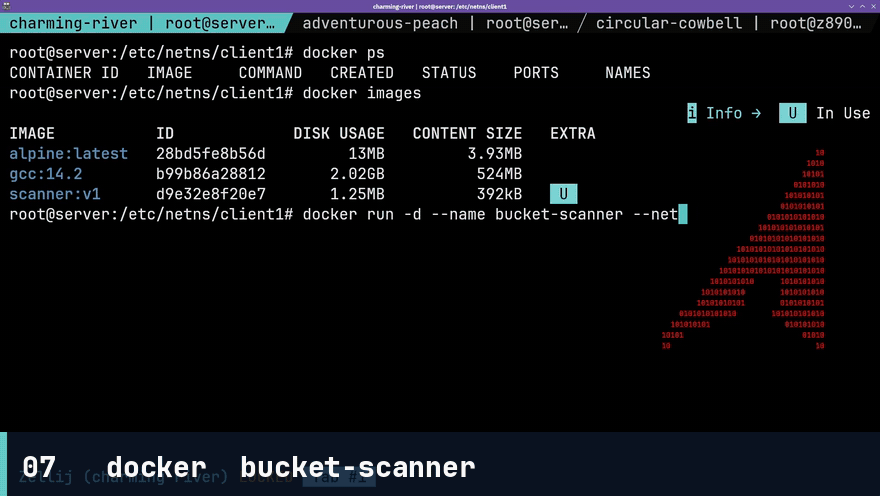

*Контейнер `bucket-scanner` в L2-сети разработчиков, без Docker NAT*

</div>

<div align="center">

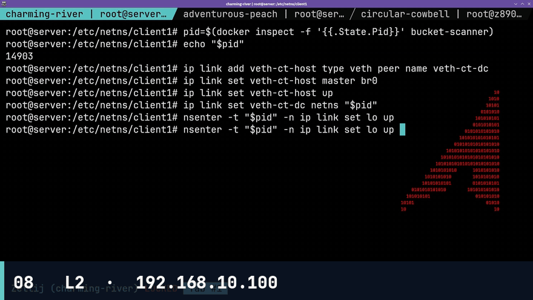

*Адрес `192.168.10.100/24`, шлюз `192.168.10.1` — прямая L2-связность*

</div>

---

## L — nftables: policy drop, SSH, WG, FORWARD, DNAT

Политика **drop** на `input`, `forward`, `output` (для output часто оставляют established + нужный egress; если в ТЗ «везде drop» — явно разрешить established/related, DNS, HTTP(S), NTP с хоста).

`/etc/nftables.conf` (каркас):

```nft
flush ruleset

define OFFICE = 10.0.0.0/24
define DEVNET = 192.168.10.0/24
define SCANNER = 192.168.10.100
define WAN_IF = enp0s3

table inet filter {
    chain input {
        type filter hook input priority 0; policy drop;
        ct state established,related accept
        iif lo accept
        ip protocol icmp accept
        ip6 nexthdr ipv6-icmp accept
        # SSH только из офиса
        tcp dport 22 ip saddr $OFFICE accept
        # WireGuard всем
        udp dport 51820 accept
        # DHCP/DNS на хосте не слушаем — dnsmasq в netns
    }

    chain forward {
        type filter hook forward priority 0; policy drop;
        ct state established,related accept
        # к scanner только из dev и office
        ip saddr $DEVNET ip daddr $SCANNER accept
        ip saddr $OFFICE ip daddr $SCANNER accept
        # выход dev-router в интернет
        ip saddr $DEVNET oifname $WAN_IF accept
        ip saddr 10.200.0.2 oifname $WAN_IF accept
    }

    chain output {
        type filter hook output priority 0; policy drop;
        ct state established,related accept
        oif lo accept
        ip protocol icmp accept
        udp dport { 53, 123 } accept
        tcp dport { 53, 80, 443, 123 } accept
        # docker/локальные нужды добавляйте точечно
    }
}

table ip nat {
    chain prerouting {
        type nat hook prerouting priority -100;
        # DNAT 8080 → scanner, только разрешённые source
        ip saddr $DEVNET tcp dport 8080 dnat to $SCANNER:8080
        ip saddr $OFFICE tcp dport 8080 dnat to $SCANNER:8080
    }
    chain postrouting {
        type nat hook postrouting priority 100;
        oifname $WAN_IF masquerade
        ip saddr 10.200.0.0/30 oifname $WAN_IF masquerade
    }
}
```

Применить: `sudo nft -f /etc/nftables.conf`.

Проверки:

- SSH с адреса вне `10.0.0.0/24` — drop
- SSH с `10.0.0.x` — accept
- UDP/51820 с любого — accept
- FORWARD на scanner с чужой сети — drop
- `curl` на `:8080` с office/dev — попадает на `192.168.10.100:8080`

<div align="center">

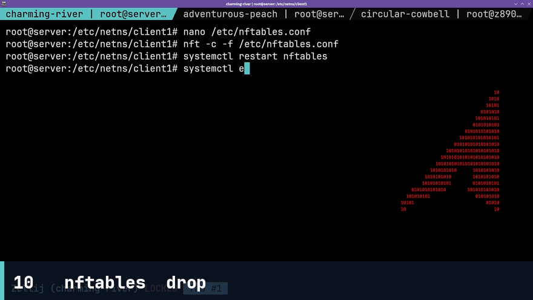

*nftables: policy drop, SSH только из `10.0.0.0/24`, DNAT `:8080` на scanner*

</div>

---

## M — WireGuard: split-tunnel стажёра + full-tunnel PBR

Сервер `/etc/wireguard/wg0.conf`:

```ini
[Interface]
Address = 10.8.0.1/24
ListenPort = 51820
PrivateKey = <SERVER_PRIVATE>

[Peer]
# стажёр intern
PublicKey = <INTERN_PUBLIC>
AllowedIPs = 10.8.0.10/32
```

Клиент стажёра (**split-tunnel**): в VPN уходит только overlay и сеть проекта, не весь интернет.

```ini
[Interface]
Address = 10.8.0.10/24
PrivateKey = <INTERN_PRIVATE>
DNS = 192.168.10.1

[Peer]
PublicKey = <SERVER_PUBLIC>
Endpoint = <WAN_IP>:51820
AllowedIPs = 10.8.0.0/24, 192.168.10.0/24
PersistentKeepalive = 25
```

В ТЗ указано `AllowedIPs=10.8.0.0/24,/srv/project_net`. `/srv/project_net` — это не CIDR; для клиента используйте сеть проекта **`192.168.10.0/24`**. Если нужен файл-список сетей, положите CIDR в `/srv/project_net` и копируйте в `AllowedIPs`.

**Сравнительный full-tunnel + PBR `t_intern`** (для документации, не для продакшен-стажёра):

`/etc/iproute2/rt_tables`:

```
103 t_intern
```

```bash
sudo ip route replace default dev wg0 table t_intern
sudo ip rule add from 10.8.0.10/32 table t_intern priority 90
```

Full-tunnel на клиенте: `AllowedIPs = 0.0.0.0/0, ::/0`. В отчёте сравните: split не гоняет интернет через стенд; full + `t_intern` шлёт весь src `10.8.0.10` в `wg0`.

`wg-quick up wg0`. На nftables UDP 51820 уже открыт всем.

<div align="center">

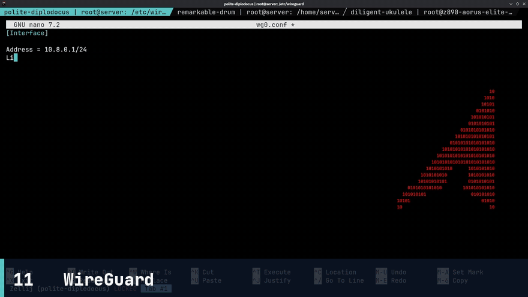

*Стажёр: split-tunnel `wg0`, доступны overlay и сеть проекта, интернет мимо VPN*

</div>

---

## Чеклист приёмки блока 2

- [ ] `dev-router`: `bond0` `192.168.10.1/24`, `br0`/`bond0` на хосте без IP
- [ ] `client1` получает DHCP из `192.168.10.10–50`, шлюз `192.168.10.1`
- [ ] failover `veth1` → `veth2`: пинги к `192.168.10.1` живы
- [ ] PBR: таблицы `t_dev`, `t_office`, `t_wan`, `ip rule` по source
- [ ] `bond-office` `10.0.0.5/24`; контейнер `192.168.10.100/24` на L2, без NAT
- [ ] nftables: policy drop; SSH только из `10.0.0.0/24`; WG UDP `51820` всем; DNAT `:8080` → scanner
- [ ] стажёр: split-tunnel (`10.8.0.0/24` + сеть проекта); интернет мимо VPN
