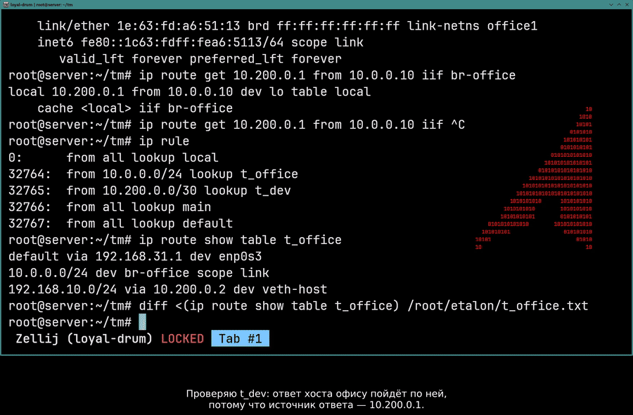
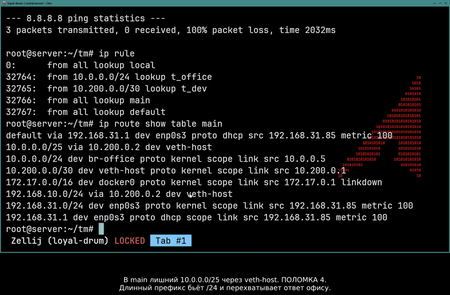
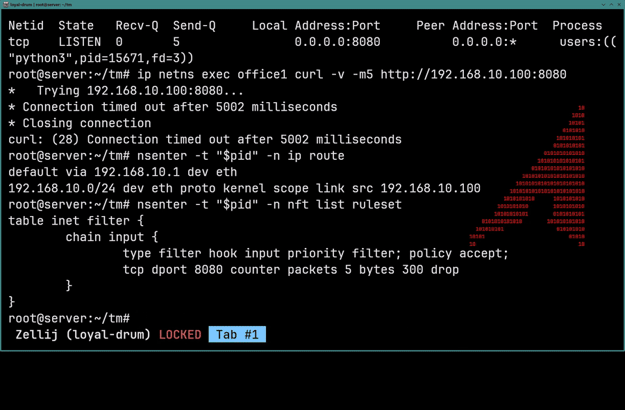
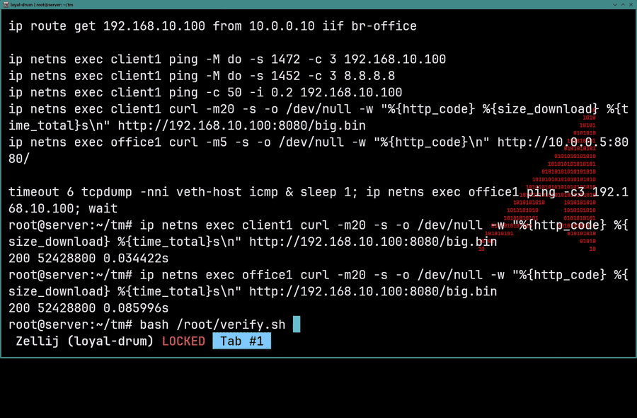

# Блок 2 — трабалшутинг

Тот же стенд, что в [блоке 2](../README.md). Скрипт вносит 8 поломок, какие именно — я до запуска не знаю. Задача: найти все, починить и вернуть стенд к эталону.



Офис не видит хост. Маршрут `10.0.0.0/24 dev br-office` на месте, запрос доходит — а ответа нет. Потому что ответ хоста рождается с адресом `10.200.0.1`, попадает под правило `from 10.200.0.0/30 lookup t_dev`, а в этой таблице нужного маршрута не оказалось, и ответ ушёл в интернет по `default`. Правила PBR применяются не только к транзиту, но и к тому, что хост порождает сам.

---

## Правила

Поломки вносит `break/break-hard3.sh`. Он выбирает по одной случайной поломке из восьми независимых пулов, ничего не печатает и запускается в отдельном окне — **набор я не вижу ни до, ни во время решения**. Скрипт лежит в репозитории ради воспроизводимости.

Полные условия — в [TZ.md](TZ.md). Коротко: чинить вслепую, один дубль без склеек, свои шпоры по синтаксису разрешены, подсказки нет. Стенд считается восстановленным только когда `verify.sh` даёт 27 зелёных строк.

## Стенд

```
                         enp0s3 ──► 192.168.31.1 (аплинк)
                            │
    ┌───────────────────────┴────────────────────────────┐
    │                     ХОСТ server                    │
    │                                                    │
    │  PBR:  from 10.0.0.0/24    ──► t_office            │
    │        from 10.200.0.0/30  ──► t_dev               │
    │                                                    │
    │   br-office 10.0.0.5/24        veth-host           │
    │      │         │                10.200.0.1/30      │
    │  bond-office  veth-of               │              │
    │  (enp0s8+       │                   │              │
    │   enp0s9)  ┌────┴─────┐             │              │
    │            │ office1  │             │              │
    │            │10.0.0.10 │             │              │
    │            └──────────┘             │              │
    │                                     │              │
    │   br0 (L2, без IP)                  │              │
    │    │      │        │                │              │
    │  bond0  veth-b1  veth-ct-host       │              │
    │  (veth1/veth2, active-backup)       │              │
    └────┼──────┼────────┼────────────────┼──────────────┘
         │      │        │                │
    ┌────┴──────┴────────┴────────────────┴──────────────┐
    │  dev-router (netns)                                │
    │  bond0 192.168.10.1/24   veth-dev 10.200.0.2/30    │
    │  nat: oifname veth-dev masquerade                  │
    └────────────────────────────────────────────────────┘
         │                          │
    ┌────┴─────┐          ┌─────────┴──────────┐
    │ client1  │          │  bucket-scanner    │
    │192.168.  │          │  192.168.10.100    │
    │  10.2    │          │  :8080 (docker)    │
    └──────────┘          └────────────────────┘
```

Задействовано: network namespaces, veth, два моста, два бонда в режиме active-backup, policy-based routing с двумя таблицами, nftables с filter и NAT (включая DNAT из офисного сегмента на сканер), контейнер в собственном сетевом неймспейсе.

## Что сломалось и как я это нашёл

| # | Поломка | Симптом | Чем локализовал |
|---|---|---|---|
| 1 | Снесена таблица `nat` на dev-router | client1 видит 10.200.0.2, но не хост | сужение пингом → `nft list ruleset` |
| 2 | `veth-b1` с MTU 1300 | `sendmsg: No buffer space available` | `ip a \| grep veth` |
| 3 | Удалён `10.0.0.0/24` из `t_dev` | офис не видит хост | `ip route get` → дифф таблиц |
| 4 | Лишний `10.0.0.0/25` в `main` | офис не видит интернет | `ip route show table main` |
| 5 | Снято правило DNAT на сканер | офис не достучится до `:8080` | `dnft` |
| 6 | Удалён `default` в контейнере | офис не достаёт, client1 достаёт | `nsenter ... ip route` |
| 7 | Чужая таблица nft в контейнере, drop на 8080 | таймаут вместо refused | `nsenter ... nft list ruleset` |
| 8 | `veth1-peer` выпал из бонда | **симптомов нет** | `verify.sh` → `/proc/net/bonding/bond0` |

Подробный разбор каждой — в [faults.md](faults.md).

## Три момента крупно

**Три поломки из восьми — одна механика.** Хост отвечает на запрос не с адреса входного интерфейса, а с того адреса, на который запрос был отправлен. Этот адрес и решает, по какой таблице пойдёт ответ, потому что правила PBR сопоставляются с уже сформированным пакетом. В результате ответы хоста уходят не туда, а запрос при этом доходит нормально — симптом выглядит как «пакеты пропадают».

- **Поломка 1.** Без masquerade ответ идёт с `10.200.0.1` в таблицу `t_dev`, где нет маршрута до `192.168.10.0/24` — и уходит по `default` в интернет.
- **Поломка 3.** Ответ офису идёт с того же `10.200.0.1`, снова в `t_dev`, а там удалён `10.0.0.0/24` — тот же исход.
- **Поломка 4.** Ответ из интернета после обратного NAT идёт по `main`, а там лишний `10.0.0.0/25` через `veth-host` — более длинный префикс перехватывает его у `10.0.0.0/24 dev br-office`.

Общий приём для всех трёх: когда запрос уходит, а ответа нет, спрашивать не «куда пойдёт пакет», а **куда пойдёт ответ** — `ip route get <кому отвечаем> from <адрес источника ответа>`.



**Отказ против таймаута.** `curl` из офиса до сканера подвисал на пять секунд и отваливался по таймауту. Если бы порт был закрыт, пришёл бы RST и `Connection refused` — значит дело не в сервисе. Пакет уходил и пропадал. Внутри контейнера нашлась своя таблица nftables с `drop` на порт 8080 и живым счётчиком.



**Поломка без симптома.** После того как всё функционально заработало, `verify.sh` всё равно показал красное: в бонде один слейв вместо двух. Сеть при этом работала полностью — трафик шёл через оставшийся слейв. Обнаружить это пингом нельзя в принципе, только сравнением с эталоном.



## Зачем эталон, а не «пингуется — значит работает»

`verify.sh` состоит из двух частей. Первая — функциональные проверки: связность, интернет, DNS, HTTP, 50 МБ через канал. Вторая — сравнение текущего состояния со снимками в `etalon/`: `ip rule`, три таблицы маршрутизации, маршруты в трёх неймспейсах и в контейнере, ruleset nftables, конфиг бонда.

Ценность здесь не в диффах как таковых, а в том, что скрипт проверяет **состояние**, а не только связность. Поломку 8 не поймал бы ни один пинг: сеть работала полностью, трафик шёл через оставшийся слейв. Поймала её строка `bond0: оба слейва в бонде` — явная проверка состояния, а дифф конфига бонда при этом был чистым, потому что `miimon` и режим не менялись.

Диффы закрывают вторую половину задачи: то, что нельзя перечислить заранее отдельными проверками. Лишний маршрут, переставленное правило, подменённый next-hop — под каждый такой случай проверку не напишешь, а дифф со снимком ловит их все разом.

У подхода есть индустриальные аналоги: `terraform plan`, `ansible --check --diff`, `kubectl diff`, OutOfSync в ArgoCD, Oxidized и RANCID для сетевого железа, AIDE и Tripwire для файловой системы. Везде одна идея — состояние сверяется с объявленным, а не проверяется на «вроде живое».

## Результат

8 из 8 найдено и починено. Один дубль, 13:19 после вырезания пауз. Финальный прогон — 27 проверок, все зелёные.

**[Полная запись решения](https://github.com/sec-cloud-dev/Linux-cases/releases/tag/block2-troubleshooting)**

## Файлы

```
verify.sh          27 проверок: функциональные + дифф против эталона
etalon/            снимки эталонного состояния (10 файлов)
break/             скрипт внесения поломок
faults.md          разбор каждой поломки
TZ.md              условия задачи
```
